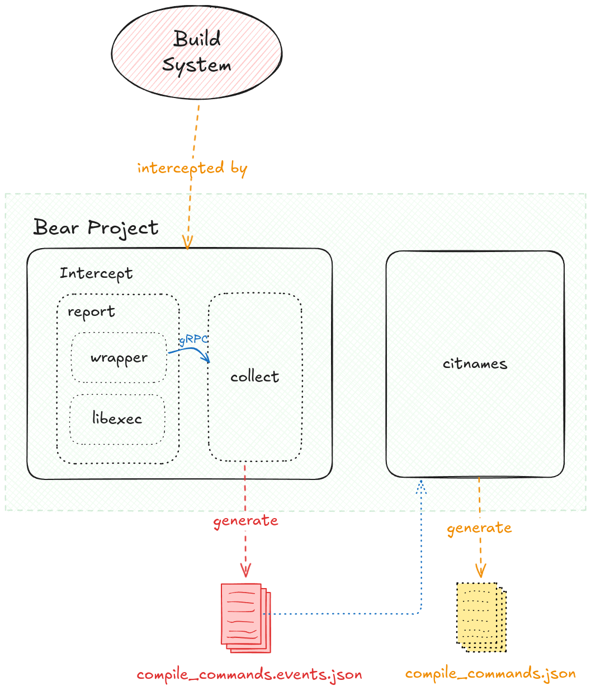

# Bear 工作原理

在这篇文章中，我们将深入探讨 Bear 的工作原理以及它在构建系统中的关键角色。Bear 是一种生成编译数据库的工具，能自动化创建 compile_commands.json 文件，从而让 Clang 等现代编译工具获得必要的编译信息，以便进行代码分析、自动补全和其他高级功能。通过捕获并记录项目编译的所有指令，Bear 极大地简化了开发过程，使 Clang 能更好地理解复杂的项目结构和依赖关系。本篇文章将涵盖 Bear 的背景、实现细节以及它在不同平台下的应用场景，帮助您更好地理解和使用 Bear。

<!-- intro -->

## Compilation Database

[Compilation Database](https://clang.llvm.org/docs/JSONCompilationDatabase.html) 是 Clang 项目中的一个规范，该规范规定了一种 JSON 文件格式，这个文件包含了编译系统编译整个项目所必须的信息，具体包含了哪些信息呢？该 JSON 文件由一个 JSON 数组构成，数组中每个 entry 对应着项目中的一个文件，每个entry 包含以下信息：

- 文件路径
- 文件名
- 编译指令
- 编译参数
- 编译输出文件名

这些信息对编译系统十分重要，通过这些信息，编译系统可以知道每个文件该如何编译、系统的依赖关系。可问题是编译系统不应该直接由 `make` 或 `CMake` 这样的工具调用么，为什么还额外需要一个 JSON 文件。原因在于 `make` 这样的工具是调用编译器编译出目标文件的，而现代编译器不止提供了编译成目标文件的功能，现代编译器还额外提供了许许多多代码分析功能，比如：代码格式化、调用链分析、符号重命名等等。使用这些功能的前提是，编译系统必须了解每个文件是如何编译的。

就比如说，有一个 `gtk` 项目，在 makefile 中我们需要指明必要的编译器 flags , 比如`-lgtk`，如果我们想用 clangd 代码高亮该项目，clangd 就必须得知道这个编译器flags，这样它才能分析到具体的 library，从而确定每个变量的定义。而 compilation database 就是 clang 规定的用来向编译器传达信息的文件格式。

下面来看一些具体的例子来体会 Compilation Database 的作用

### 静态分析

假如有以下代码：
::: code-group
<<< ./div.c{c:line-numbers{7}}
:::

注意到第 7 行有一个除零错误，编译器在编译期就应该知道变量 z 在第七行时等于 0，所以像 `clang-check` 这样的静态分析软件应该会对这段程序有所反映。但在我们执行了 `clang-check -analyze div.c --` 之后并没有任何警告。
::: tip
在当前目录下没有 Compilation Database 的情况下使用 `cargo-check` 必须加上参数 `--` 。
:::
没有警告的原因是默认情况下 `FOO` 变量未定义，在编译的“宏展开阶段”中，第 7 行代码被忽略了，所以 `clang-check` 没有抱怨这段代码，我们可以加上 FOO 的定义试试：
```sh 
> clang-check -analyze div.c -- -DFOO
/home/annya/blog/writeups/bear/div.c:7:16: warning: Division by zero [core.DivideZero]
        return DODIV(1, z);
               ^~~~~~~~~~~
/home/annya/blog/writeups/bear/div.c:2:26: note: expanded from macro 'DODIV'
#define DODIV(a, b) ((a) / (b))
                     ~~~~^~~~~
1 warning generated.
```
这时候就有警告信息了。如果我希望编译系统检验上述两种情况，就必须让编译系统知道对应的 flags。这时候就可以用到 Compilation Database 了。我们定义如下文件`compile_commands.json`:

<<< ./compile_commands.json{json}

再次运行 `clang-check` ，这次不用加最后的 `--`：

```sh 
> clang-check -analyze div.c
div.c:7:16: warning: Division by zero [core.DivideZero]
        return DODIV(1, z);
               ^~~~~~~~~~~
div.c:2:26: note: expanded from macro 'DODIV'
#define DODIV(a, b) ((a) / (b))
                     ~~~~^~~~~
1 warning generated.
```

至此我们知道了 Compilation Database 的作用，但这个文件如何生成呢？需要自己敲出来么？

### 生成 Compilation Database
手敲当然可以，但肯定是不现实的。像 `CMake` 这样的工具可以自动生成 `compile_commands.json` 文件，而 `GNUMake` 这样的老古董是不能自动生成 Compilation Database 的，这时候我们就可以依靠 Bear 工具来自动生成编译数据库。
Bear 的使用方法很直接，如果原来的编译指令是 `make` , 那么只需要执行 `bear -- make` 便可以生成 `compile_commands.json` 了。

::: warning
TODO: 介绍 Compliation Database 在代码生成、依赖图等方面对编译系统的作用
:::

## Bear 的原理
Bear 的思路是这样的，既然 makefile 已经知道该如何编译整个项目了，那么 Bear 只需要**截取** makefile 调用的每一条编译指令，通过分析这些编译指令就可以构建出 `compile_commands.json` 了。
问题是，该如何**截取**呢？在 Linux 系统中可以使用 `LD_PRELOAD` 环境变量加载 bear 的动态库，在这个动态库中 `execvp` 这样的运行其他程序（比如运行编译器 gcc）的系统函数会被“重载”，Bear 会在自己的动态库中记录调用过的所有编译指令，并且继续调用原始的 execvp 指令，在记录了所有的编译指令后，Bear 就掌握了充分的信息来构建 `compile_commands` 。

通过下面的这段示例代码来了解这个过程具体是如何运作的：

<<< ./hook_execvp.c

:::tip
`dlsym` 是一个用于在运行时从共享库（动态链接库）中查找符号（通常是函数或全局变量）的函数，通常用于实现动态加载库的功能。该函数的第一个参数是 `dlopen` 函数返回的句柄，用来查找 `dlopen` 函数打开的共享库中的符号。这里使用的 `RTLD_NEXT` 是一个特殊句柄，用来查找当前库之后的库中的符号，该句柄通常用在动态库中的重载系统函数中。
:::

将该文件编译成动态库：
```sh
gcc -shared -fPIC -o hook_execp.so hook_execvp.c -ldl
```
- `shared`：生成动态库
- `fPIC`：生成位置无关代码
- `ldl`：链接动态库支持

使用该动态库劫持 gcc 指令：
```sh
> LD_PRELOAD=./hook_execvp.so gcc -o hello hello.c
Intercepted command: as as --64 -o /tmp/ccGnhoSF.o /tmp/ccBOaTyw.s
Intercepted command: /usr/bin/ld /usr/bin/ld -plugin ...
```
注意到，gcc 指令调用了另外两个指令 `as` 和 `ld` ，分别用来编译汇编文件和链接。

## Bear 的实现

### 下载并编译 Bear 项目
1. 下载源码
```sh
> git clone https://github.com/rizsotto/Bear
```
2. 编译源码
Bear 依赖一些第三方库：`spdlog`, `fmt`, `gRPC`, `json`，如果系统中没有这些库的话，Bear 会在构建过程中编译这些库，其中 spdlog 库的编译挺花时间的，如果你想节省编译时间，可以提前在系统中安装这些包。
根据官方[编译文档](https://github.com/rizsotto/Bear/blob/master/INSTALL.md)使用下面的命令编译
```sh
cmake -DENABLE_UNIT_TESTS=OFF -DENABLE_FUNC_TESTS=OFF -DCMAKE_INSTALL_LIBDIR=lib/x86_64-linux-gnu build
make all
make install
```
为了方便后面用 vim 浏览代码，我们需要生成`compile_commands.json`（这也正是 Bear 项目存在的目的），`CMake`是默认支持生成`Compilation Database`的，只需要加上 flag：`-DCMAKE_EXPORT_COMPILE_COMMANDS=1`即可，但如果你只是在上面的编译指令中加入这个 flag，会发现没有生成`compile_commands.json`。为了了解具体如何生成`compile_commands.json`，我们需要深入 Bear 项目的编译系统。

3. 生成 Bear 项目的`compile_commands.json`
Bear 项目根目录由以下部分组成：除去和构建相关的 gcc, cc1, as, collect2, ld, Bear 一共创建了三个进程：

bear intercept: 创建 intercept 进程
wrapper: 创建 wrapper 进程
bear citnames: 创建 citnames 进程

- `rust/`: Bear 项目正在向 Rust 语言迁移，目前 Bear 项目还没有用到 Rust 代码，所以这里的内容我们可以忽略
- `source/`: Bear 项目的主体
    - `bear/`: 1. 程序入口，`main.c`所在地。2. 定义`libmain`中`Application`的子类。
    - `citnames/`: 解析`intercept`获取到的指令
    - `intercept/`: 用于截获编译指令
    - `libflags/`: 处理 bear 指令的 flags
    - `libmain/`: 定义入口函数的行为，后面会讲
    - `libresult/`: 定义类似 rust 的返回值类型`Result`
    - `libshell/`: 处理 shell 命令字符串
    - `libsys/`: 操作系统抽象层，定义了路径、进程、信号等抽象
    - `CMakeLists.txt`: Bear 项目主体的 CMake 文件
- `test/`: 测试集，可暂时忽略
- `third_party/`: 第三方依赖，由一些 CMakeLists 组成，用来告诉 CMake 如何下载、编译第三方库
- `CMakeLists.txt`: 根目录下的 CMake 文件

进入到 Bear 项目根目录下的`CMakeLists.txt`，这个文件的头几行检查并安装了必要的第三方库，最重要的部分是[这里](https://github.com/rizsotto/Bear/blob/777954d4c2c1fc9053d885c28c9e15f903cc519a/CMakeLists.txt#L49-L90)，使用[`ExternalProject_Add`](https://cmake.org/cmake/help/latest/module/ExternalProject.html)命令构建 Bear 项目本身，`ExternalProject_Add`相当于额外执行了一次 cmake，本身是不受原先 cmake 指令里 flags 的影响的，所以我们在根目录下设置 cmake 的`-DCMAKE_EXPORT_COMPILE_COMMANDS`是不会影响到 BearSource 项目的。
解决方案很简单就是在`ExternalProject_Add`指令中加上`-DCMAKE_EXPORT_COMPILE_COMMANDS`指令即可：
:::code-group
```cmake [CMakeLists.txt]
ExternalProject_Add(BearSource
        SOURCE_DIR
            "${CMAKE_CURRENT_SOURCE_DIR}/source"
        DEPENDS
            nlohmann_json_dependency
            fmt_dependency
            spdlog_dependency
            grpc_dependency
            googletest_dependency
        CMAKE_ARGS
            -DENABLE_UNIT_TESTS:BOOL=${ENABLE_UNIT_TESTS}
            -DENABLE_MULTILIB:BOOL=${ENABLE_MULTILIB}
            -DPKG_CONFIG_EXECUTABLE:PATH=${PKG_CONFIG_EXECUTABLE}
        CMAKE_CACHE_ARGS
            -DCMAKE_EXPORT_COMPILE_COMMANDS:BOOL=1 // [!code ++]
            -DCMAKE_PROJECT_VERSION:STRING=${CMAKE_PROJECT_VERSION}
            -DCMAKE_BUILD_TYPE:STRING=${CMAKE_BUILD_TYPE}
            -DCMAKE_TOOLCHAIN_FILE:PATH=${CMAKE_TOOLCHAIN_FILE}
            -DCMAKE_FIND_ROOT_PATH:PATH=${CMAKE_FIND_ROOT_PATH}
...
```
:::
更改完后再编译一次就能在 `buiuld` 目录中得到 `compile_commands.json` 了。

### Bear 的架构
Bear 的架构和上面的原理概述中介绍的差不多，如下图：

- Bear 主要由两部分组成：`intercept`和`citnames`
- `intercept`负责截获编译指令
- `citnames`是倒过来写的"semantic"，用来分析截获指令的语义
- `wrapper`和`collect`通过 gRPC 沟通
- `compile_commands.events.json`这个中间文件保存着编译指令，由 collect 生成，之后由 citnames 读取
- `compile_commands.json`最终由`citnames`生成

### 调试 Bear
在 Bear 中可以使用指令`Bear --verbose -- command` 获取调试信息。

仍以上面的示例代码`hello.c`为例子，看看 Bear 输出了哪些信息：
```sh
> bear --verbose -- gcc -o hello hello.c
```
这条指令的输出很长，我把它放在[这里](https://github.com/An-n-ya/blog/blob/main/writeups/bear/log)。尽管长，我们可以先关注某一个方面，比如 Bear 新建了哪些进程。
Bear 在新建进程的时候会输出`Process Spawned`，从上面的输出信息中我们可以找到下面的内容
```sh
[21:44:34.331863, br, 784636] Process spawned. [pid: 784637, command: ["/usr/local/bin/bear", "intercept", "--library", "/usr/local/lib/x86_64-linux-gnu/bear/libexec.so", "--wrapper", "/usr/local/lib/x86_64-linux-gnu/bear/wrapper", "--wrapper-dir", "/usr/local/lib/x86_64-linux-gnu/bear/wrapper.d", "--output", "compile_commands.events.json", "--verbose", "--", "gcc", "-o", "hello", "hello.c"]]
[21:44:34.342143, br, 784637] Process spawned. [pid: 784645, command: ["/usr/local/lib/x86_64-linux-gnu/bear/wrapper", "--destination", "dns:///localhost:33063", "--verbose", "--execute", "/usr/bin/gcc", "--", "gcc", "-o", "hello", "hello.c"]]
[21:44:34.358456, wr, 784645, ppid: 784637] Process spawned. [pid: 784653, command: ["gcc", "-o", "hello", "hello.c"]]
[21:44:34.383993, wr, 784654, ppid: 784653] Process spawned. [pid: 784661, command: ["/usr/lib/gcc/x86_64-linux-gnu/11/cc1",...]]
[21:44:34.419255, wr, 784664, ppid: 784653] Process spawned. [pid: 784674, command: ["as",...]]
[21:44:34.433222, wr, 784675, ppid: 784653] Process spawned. [pid: 784686, command: ["/usr/lib/gcc/x86_64-linux-gnu/11/collect2",...]]
[21:44:34.441378, wr, 784689, ppid: 784686] Process spawned. [pid: 784702, command: ["/usr/bin/ld",...]]
[21:44:34.454682, br, 784636] Process spawned. [pid: 784714, command: ["/usr/local/bin/bear", "citnames", "--input", "compile_commands.events.json", "--output", "compile_commands.json", "--run-checks", "--verbose"]]
```

除去和构建相关的`gcc`, `cc1`, `as`, `collect2`, `ld`, Bear 一共创建了三个进程：
- `bear intercept`: 创建 intercept 进程
- `wrapper`: 创建 wrapper 进程
- `bear citnames`: 创建 citnames 进程

下面我们从 Bear 的 main 函数开始看看这三个进程是如何创建的，以及`LD_PRELOAD`是如何被写入环境变量的。

### 从 `main` 函数开始
Bear 的入口在[这里](https://github.com/rizsotto/Bear/blob/777954d4c2c1fc9053d885c28c9e15f903cc519a/source/bear/main.cc#L23-L25)，这个 main 函数调用了 libmain 里的 main 函数，如下：
```c++
template <class App>
int main(int argc, char* argv[], char* envp[]) {
    App app;
    auto ptr = reinterpret_cast<ps::Application*>(&app);

    return ptr->command(argc,
                        const_cast<const char **>(argv),
                        const_cast<const char **>(envp))
            .and_then<int>([](const ps::CommandPtr &cmd) {
                return cmd->execute();
            })
            // print out the result of the run
            .on_error([](auto error) {
                spdlog::error("failed with: {}", error.what());
            })
            .on_success([](auto status_code) {
                spdlog::debug("succeeded with: {}", status_code);
            })
            // set the return code from error
            .unwrap_or(EXIT_FAILURE);
}
```
这是一个泛型函数，在刚刚的调用中泛型参数是`bear::Application`，这个类型定义在`$BEAR_PROJECT/source/bear/source/Application.cc`中，我们先来看看上面的这段代码的含义。这段代码看起来很像[函数式语言](https://en.wikipedia.org/wiki/Functional_programming)，`ptr->command`,`and_then`,`on_error`这三个函数的返回值都是 rust::Result，这个类型定义在`libresult`中。这种函数式编程的模式看起来很复杂，其实只要熟悉了就会觉得很清晰，我们在阅读这段代码的时候可以只关注成功情况忽略错误情况，下面我把这段代码调用过程（只包含成功情况）用过程式的方式写出来：
```:line-numbers
ps::Application::command()[virtual]
    ps::ApplicationFromArgs::command()
        ps::ApplicationFromArgs::parse()[virtual]
            bear::Application::parse()
        ps::ApplicationFromArgs::command()[virtual]
            bear::Application::command()
    Command::execute()
```
其中第 4 行`bear::Application::parse()`函数设置了一些默认参数，这些默认参数会在新建进程的时候使用，举个例子，在上面我们分析了 Bear 启动后创建了哪些进程，关注启动的第一个进程的参数：

`[21:44:34.331863, br, 784636] Process spawned. [pid: 784637, command: ["/usr/local/bin/bear", "intercept", "--library", "/usr/local/lib/x86_64-linux-gnu/bear/libexec.so", "--wrapper", "/usr/local/lib/x86_64-linux-gnu/bear/wrapper", "--wrapper-dir", "/usr/local/lib/x86_64-linux-gnu/bear/wrapper.d", "--output", "compile_commands.events.json", "--verbose", "--", "gcc", "-o", "hello", "hello.c"]]`

像`--library`, `--wrapper`, `--wrapper-dir`, `--output` 这些 flags 的参数都是通过`bear::Application::parse()`函数设置的，由于我们执行`bear`指令的时候没有指定这些 flags 的值，所以这些值都被设置为默认值，这些默认值的模板定义在[source/config.h.in](https://github.com/rizsotto/Bear/blob/master/source/config.h.in)，最终的默认值将会被定义在一个由编译系统生成的 config.h 文件中，它位于`$BUILD_DIR/subprojects/Build/BearSource/config.h`。以`--library`flag 为例，它的默认值由`cmd::library::DEFAULT_PATH`确定，由于我的系统是 Linux，所以它的值是`/usr/local/lib/x86_64-linux-gnu/bear/libexec.so`，这和上面的调试信息中的参数是吻合的。

### `command` 指令
上面的分析中我们知道了默认参数是如何被设置的，我们还知道了在执行完`parse`指令后马上执行了`command`指令，这个指令作用是什么呢？
之前已经提到过 Bear 在启动后会启动 3 个进程，这三个进程的启动命令就是由这里的 command 指令定义的。

在`bear::Application::command`方法中最重要的工作是下面的几行代码：
```c++
auto intercept = prepare_intercept(args, environment, commands);
auto citnames = prepare_citnames(args, environment, commands);

return rust::merge(intercept, citnames)
    .map<ps::CommandPtr>([&commands](const auto& tuple) {
        const auto& [intercept, citnames] = tuple;

        return std::make_unique<Command>(intercept, citnames, commands);
    });
```
`intercept`和`citnames`的类型都是`sys::process::Builder`，这个类型是 Bear 对创建进程的抽象（不同操作系统有不同的创建进程的方式）。上面的段代码最后返回了一个`Command`，这个 Command 包含了`intercept`和`citnames`两个成员。
这个 Command 最终会执行`execute`方法，这个方法定义如下：
```c++
[[nodiscard]] rust::Result<int> Command::execute() const
{
	auto result = ::execute(intercept_, "intercept");

	std::error_code error_code;
	if (fs::exists(output_, error_code)) {
		::execute(citnames_, "citnames");
		fs::remove(output_, error_code);
	}
	return result;
}

```
`::execute`中调用了`builder.sapwn`来新建进程，这段代码的含义就是创建 intercept 进程，如果`compile_commands.events.json`存在的话，就新建`citnames`进程，在 citnames 进程执行结束后就删除`compile_commands.events.json`。

到这里我们明白了 Bear 会首先启动 intercept，如果 intercept 有输出`compile_commands.events.json`（这个文件保存着编译指令）的话，就启动`citnames`进程分析截获的编译指令并生成`compile_commands.json`。

那么为什么在调试信息中还创建了一个名叫"wrapper"的进程呢？

### intercept 子指令
上面提到`Application::command`会创建两个 builder: `intercept`和`citnames`，并执行它们，执行它们就相当于执行了`bear intercept ...` 和 `bear citnames ...` 这两个子指令。这两个子指令在`Application::command`中被处理，最终会调用`Intercept::command`和`Citnames::command`的方法生成它们各自的 CommandPtr，并执行各自的`execute`方法。

下面看看 Intercept::command 方法的实现
```c++
rust::Result<ps::CommandPtr> Intercept::command(const flags::Arguments &args, const char **envp) const {
   const auto execution = capture_execution(args, sys::env::from(envp));
   const auto session = Session::from(args, envp);
   const auto reporter = Reporter::from(args);

   return rust::merge(execution, session, reporter)
           .map<ps::CommandPtr>([](auto tuple) {
               const auto&[execution, session, reporter] = tuple;
               return std::make_unique<Command>(execution, session, reporter);
           });
    }

```
- `capture_execution` 处理构建指令，在我们这里就是`gcc -o hello hello.c`
- `Session::from` 根据配置构建`SessionLibrary`或`SessionWrapper`，前者使用 LD_PRELOAD 环境变量加载 libexec.so 截获编译指令，后者通过 wrapper 截获编译指令。
- `Reporter::from` 构建读写`compile_commands.events.json`的 handle。

再看下 intercept 下的 Command::execute
```c++:line-numbers
rust::Result<int> Command::execute() const
{
    // Create and start the gRPC server
    int port = 0;
    ic::SupervisorImpl supervisor(*session_);
    ic::InterceptorImpl interceptor(*reporter_);
    auto server = grpc::ServerBuilder()
                        .RegisterService(&supervisor)
                        .RegisterService(&interceptor)
                        .AddListeningPort("dns:///localhost:0", grpc::InsecureServerCredentials(), &port)
                        .BuildAndStart();

    // Create session_locator URL for the services
    auto session_locator = SessionLocator(fmt::format("dns:///localhost:{}", port));
    spdlog::debug("Running gRPC server. {0}", session_locator);
    // Execute the build command
    auto result = session_->run(execution_, session_locator);
    // Stop the gRPC server
    spdlog::debug("Stopping gRPC server.");
    server->Shutdown();
    // Exit with the build status
    return result;
}
```
前 16 行是创建一个 gRPC Server，关于 gRPC 的内容我们下一节再说，这一节重点关注上面代码的第 17 行，这一行调用了 Session::run 方法，run 方法里边主要是调用了 supervise 方法，supervise 方法是 Session 的一个虚方法，它有两个实现，分别来自`SessionLibrary`和`SessionWrapper`，前者就是基于 LD_PRELOAD 的（最后还是要使用 wrapper 往 gRPC Server 发送消息），后者直接构造 Wrapper。

我们先看前者，也就是`SessionLibrary`的实现，它的`supervise`方法实现如下：
```c++
sys::Process::Builder LibraryPreloadSession::supervise(const ic::Execution &execution) const
{
    auto builder = sys::Process::Builder(executor_)
            .add_argument(executor_)
            .add_argument(cmd::wrapper::FLAG_DESTINATION)
            .add_argument(*session_locator_);

    if (verbose_) {
        builder.add_argument(cmd::wrapper::FLAG_VERBOSE);
    }

    return builder
            .add_argument(cmd::wrapper::FLAG_EXECUTE)
            .add_argument(execution.executable)
            .add_argument(cmd::wrapper::FLAG_COMMAND)
            .add_arguments(execution.arguments.begin(), execution.arguments.end())
            .set_environment(update(execution.environment));
}
```
这段代码构造了一个 Prcess::Builder，这是准备又要创建一个进程了，创建什么进程呢？第一个参数就是要创建的进程，第一个参数为`executor_`，这是`LibraryPreloadSession`的成员变量，它的定义来自于该类的构造函数`LibraryPreloadSession::from`，在 from 函数中，`cmd::jintercept::FLAG_WRAPPER`flag 的值被放入`executor_`中，也就是说，这里要新建的进程就是另一个 wrapper。
再回到`LibraryPreloadSession::supervise`方法中，考察后面传入了哪些参数，首先是`--destination`，这个参数的值是刚刚创建的 gRPC Server 的地址，然后是关于`execution`的信息，也就是编译指令的信息，比如它的命令名、参数、环境变量。这个 execution 是作为 supervice 的参数传进来的，而这个参数是一路从`Intercept::command`构造函数中传过来的，在本例中，我们正在处理子指令
```
/usr/local/bin/bear intercept --library /usr/local/lib/x86_64-linux-gnu/bear/libexec.so --wrapper /usr/local/lib/x86_64-linux-gnu/bear/wrapper --wrapper-dir /usr/local/lib/x86_64-linux-gnu/bear/wrapper.d --output compile_commands.events.json --verbose -- gcc -o hello hello.c
```
所以这里的参数就是`--`后面的内容，也就是`gcc -o hello hello.c`。

还有一点需要注意，在`LibraryPreloadSession::supervise`的最后一行中调用了`udpate`方法，这个方法设置环境变量`LD_PRELOAD`的值为 flag `--library` 的值，也就是设置环境变量`LD_PRELOAD=/usr/local/lib/x86_64-linux-gnu/bear/libexec.so`，这个 libexec 就是用来截获编译指令的动态库，和上面介绍的原理是吻合的。

问题是为什么一定要新建一个 wrapper 进程呢？wrapper 进程的作用它的名字所暗示的，它是对编译指令的包装，在执行编译指令前先用 wrapper 包装，wrapper 会把编译指令信息通过 gRPC 传给 collect。在后面对 libexec 的分析中我们会发现，libexec 截获的每一条编译指令都会被改写成 wrapper。

在介绍 libexec 之前，我们先看看 gRPC 相关的代码，看下 wrapper 具体是怎么和 collect 沟通的。

### gRPC 相关
Bear 项目一共定义了两个服务：`Supervisor`和`Interceptor`，和若干数据类型

- 数据类型 `Execution`
该类型包括四个成员：
    - executable 命令本身
    - arguments 命令参数
    - working_dir 目录
    - environment 环境变量
这个类型基本上包含了 Compilation Database Entry 所需的所有信息。

- Supervisor 服务
该服务只有一个接口：`Resolve`，该接口接受一个 Execution 类型的数据，输出一个 Execution 类型的数据
在 wrapper 执行每条编译指令之前，它需要知道该怎么获取该编译指令的子进程（对于 LD_PRELOAD 方法来说，并不需要这个信息，但对于纯 wrapper 方法来说，这个信息是必要的），`SessionLibrary`和`SessionWrapper`提供了自己的 resolve 方法，`SessionLibrary`的 resolve 方法只是简单地把输入复制到输出，`SessionWrapper`的 resolve 方法之后再介绍。

- Interceptor 服务
该服务只有一个接口：`Register`，该接口接受 Event 类型，Event 类型包含了关于编译指令的必要信息，比如 Event 类型包含了`Execution`类型，除此之外，它还包含进程号、父进程号、进程返回值、进程信号量。

对于`Interceptor`服务，先看下接受端的代码，接受端定义在`InterceptorImpl::Register`中：
```c++
grpc::Status InterceptorImpl::Register(grpc::ServerContext*, const rpc::Event* request, google::protobuf::Empty*)
{
    reporter_.report(*request);
    return ::grpc::Status::OK;
}
```
reporter_的类型是`Reporter`，定义在`intercept/source/collect/Reporter.cc`，它的 report 代码定义如下：
```c++
void Reporter::report(const rpc::Event& event) {
    const std::lock_guard<std::mutex> lock(mutex_);

    database_->insert_event(event)
            .on_error([](auto error) {
                spdlog::warn("Writing event into database failed: {} Ignored.", error.what());
            });
}
```
其作用就是往`compile_commands.events.json`中写入 event。database 相关的实现在`intercept/source/collect/db`中，比较简单就不单独拿出来说了。

再看看发送端的代码，发送端在`InterceptorClient::report`中，
```c++
rust::Result<int> InterceptorClient::report(const rpc::Event &event) {
    spdlog::debug("gRPC call requested: supervise::Interceptor::Register");

    grpc::ClientContext context;
    google::protobuf::Empty response;
    const grpc::Status status = interceptor_->Register(&context, event, &response);

    spdlog::debug("gRPC call [Register] finished: {}", status.ok());
    return status.ok()
            ? rust::Result<int>(rust::Ok(0))
            : rust::Result<int>(rust::Err(create_error(status)));
}
```
这里调用了 gRPC protobuf 中定义的`Register`接口。
report 方法的调用链为`wr::Command::execute` -> `wr::EventReporter::report_start`(通过 pid、execution 构建 event) -> `wr::InterceptorClient::report`

### libexec
`source/intercept/source/report/libexec`这个文件夹中的内容会被编译成一个动态库，这个动态库的入口在[这里](https://github.com/rizsotto/Bear/blob/777954d4c2c1fc9053d885c28c9e15f903cc519a/source/intercept/source/report/libexec/lib.cc#L100-L115)，这里创建的全局变量`SESSION`是 libexec 自己的，这个类型有两个重要的成员`reporter`和`destination`，这里的 reporter 会被设置为默认值`/usr/local/lib/x86_64-linux-gnu/bear/wrapper`，而 desitination 会被设置为 gRPC server。

当 libexec 截获到指令时，会使用全局变量`SESSION`构建一条指令，指令的 path 是就是 reporter，也就是`wrapper`，截获到的指令会作为参数传入给 wrapper。

wrapper 中有自己的 gRPC Client 与 intercept 的 gRPC Server 交换信息。


## Bear 的架构分析
前面我们只是分析了 Bear 是如何实现的，但我们还没有讨论 Bear 为什么会这么设计、这样设计的优缺点是什么这样的问题，我们学习开源项目不是简单地分析下执行流程就完事的，我们还需要知道分析项目架构的优缺点，这才是学习开源项目的重点。

现在我们不看源码，回想下 Bear 系统究竟做了写什么


### 为什么要这么设计呢
既然 Bear 只是构建了一个个启动命令，为什么还要整这么麻烦呢？
有以下几点：
- Bear 是一个跨平台程序
- Bear 高度可配置，比如 reporter 就不必是 wrapper，只要能生成`compile_commands.events.json`，什么 reporter 都可以

## 参考资料
- [Compilation databases for Clang-based tools](https://eli.thegreenplace.net/2014/05/21/compilation-databases-for-clang-based-tools)
- [JSON Compliation Database Format Sepecification](https://clang.llvm.org/docs/JSONCompilationDatabase.html)

