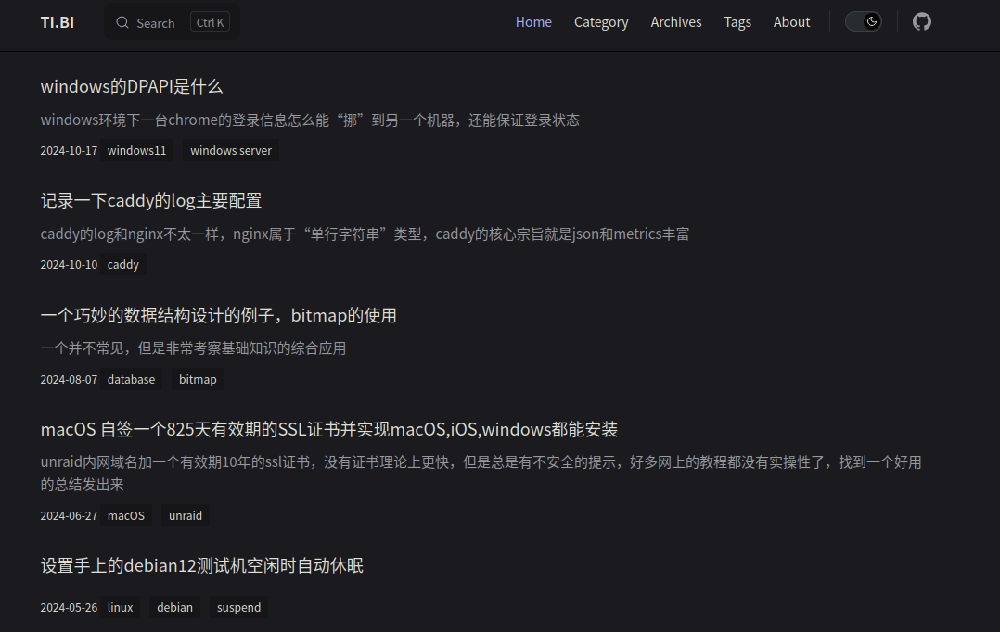

# 博客开发日志

本系列文章会记录本博客的开发日志以及相关的博客开发相关的内容。
vitepress 项目主要是用作项目的文档网站，它对个人博客的支持并不是开箱即用的，你可能需要使用一些第三方 theme 才能得到一个基本的博客网站的结构。一个基本的博客一般包括以下结构：

- 主页（一般是按时间展示过往文档）
- 归档（按标签分类、按时间/阅读量排序）
- 评论区

下面我按这些结构组织我是如何实现这些结构的。

## 博客主页
vitepress 原生的主页只支持自定义 hero 和 feature ，这些结构往往是开源项目的主页所需的，个人博客的主页往往展示过往文章。好在 vitepress 给了用户足够多的自由度自定义每个页面，在这里我们先看看社区中是如何自定义vitepress主页的。

我主要看了这个[awesome vitepress list](https://github.com/logicspark/awesome-vitepress-v1)，里边这两个 theme 是我比较喜欢的：

- [vitepress-blog-pure](https://github.com/airene/vitepress-blog-pure) 这个 theme 十分小巧，很适合初学者入手
- [sugar-blog](https://github.com/ATQQ/sugar-blog) 该 theme 功能齐全、代码结构清晰、内容丰富，很适合作为学习材料和模仿对象

我们来看看这两个 theme 是如何实现主页的：

### vitepress-blog-pure
[vitepress-blog-pure](https://ti.bi/)的主页长这样：



导航栏基本没变，主页主体变成了过往文章，主页最后还有一个分页器。

首先看下该项目的目录结构：
```sh
.
├── .vitepress
│   ├── config.ts
│   └── theme
│       ├── components
│       │   ├── Archives.vue
│       │   ├── Category.vue
│       │   ├── Comment.vue
│       │   ├── Copyright.vue
│       │   ├── NewLayout.vue
│       │   ├── Page.vue
│       │   └── Tags.vue
│       ├── custom.css
│       ├── functions.ts
│       ├── index.ts
│       └── serverUtils.ts
├── index.md
├── package.json
├── pages
│   ├── about.md
│   ├── archives.md
│   ├── category.md
│   └── tags.md
├── posts
│   └── vitepress-first.md
├── public
│   ├── favicon.ico
│   └── test.jpg
├── README.md
├── tsconfig.json
└── yarn.lock
```
首先会发现整个项目中没有`index.md`，这个文件应该是默认的 vitepress 主页才对，其实`index.md`是在构建的过程中生成的，具体的逻辑在`.vitepress/config.ts`的第14行：
```js:line-numbers{14}
import { defineConfig } from 'vitepress'
import { getPosts } from './theme/serverUtils'

//每页的文章数量
const pageSize = 10

export default defineConfig({
    title: 'Vitepress blog',
    base: '/',
    cacheDir: './node_modules/vitepress_cache',
    description: 'vitepress,blog,blog-theme',
    ignoreDeadLinks: true,
    themeConfig: {
        posts: await getPosts(pageSize),
        website: 'https://github.com/airene/vitepress-blog-pure', //copyright link
        // 评论的仓库地址
        comment: {
            repo: 'airene/vitepress-blog-pure',
            themes: 'github-light',
            issueTerm: 'pathname'
        },
...
```
14 行调用了一个 async 函数 `getPosts`。这个函数返回的对象保存在`themeConfig.posts`中，根据 [vitepress文档](
) 中关于 useState 的说明，这个 posts 可以通过 `useState().theme.value.posts` 访问到，`getPosts`函数中会创建关于项目中所有文章的元信息以便在运行时访问，这个信息对于展示过往文章列表尤其重要。`ghetPosts` 函数的实现如下：
```js:line-numbers{10}
import { globby } from 'globby'
import matter from 'gray-matter'
import fs from 'fs-extra'
import { resolve } from 'path'

async function getPosts(pageSize: number) {
    let paths = await globby(['posts/**.md'])

    //生成分页页面markdown
    await generatePaginationPages(paths.length, pageSize)

    let posts = await Promise.all(
        paths.map(async (item) => {
            const content = await fs.readFile(item, 'utf-8')
            const { data } = matter(content)
            data.date = _convertDate(data.date)
            return {
                frontMatter: data,
                regularPath: `/${item.replace('.md', '.html')}`
            }
        })
    )
    posts.sort(_compareDate as any)
    return posts
}
```
这里用到了两个第三方包：`globby`和`gray-matter`，前者用来遍历文件目录（寻找目录下的 markdown 文件），后者用来处理 markdown 文件的 frontmatter 。这段代码除第10行以外的作用就是遍历当前目录，查找到所有的markdown文件，并将这些文件的目录信息、时间信息、frontmatter信息记录在posts变量中返回给调用者。

而第 10 行代码的作用就是生成上文中提到的`index.md`文件。

```js:line-numbers{7-26}
async function generatePaginationPages(total: number, pageSize: number) {
    //  pagesNum
    let pagesNum = total % pageSize === 0 ? total / pageSize : Math.floor(total / pageSize) + 1
    const paths = resolve('./')
    if (total > 0) {
        for (let i = 1; i < pagesNum + 1; i++) {
            const page = `
---
page: true
title: ${i === 1 ? 'home' : 'page_' + i}
aside: false
---
<script setup>
import Page from "./.vitepress/theme/components/Page.vue";
import { useData } from "vitepress";
const { theme } = useData();
const posts = theme.value.posts.slice(${pageSize * (i - 1)},${pageSize * i})
</script>
<Page :posts="posts" :pageCurrent="${i}" :pagesNum="${pagesNum}" />
`.trim()
            const file = paths + `/page_${i}.md`
            await fs.writeFile(file, page)
        }
    }
    // rename page_1 to index for homepage
    await fs.move(paths + '/page_1.md', paths + '/index.md', { overwrite: true })
}
```
该函数的 7-20 行便是所要生成的文档的模板，这个模板最终会保存到 `md` 后缀的文件中，而 vitepress 中的 markdown 文件是支持使用 vue 的，所以这里的模板虽然是用来生成 markdown 的，但看起来更像是 vue 的模板。第 17 行使用 `useData` 获取了上文中提到的 posts 信息，并将这个信息传递给了 `Page` 这个 Component，我们将在后文中介绍该组件。第 26 行将第一个分页重命名为 `index.md` 作为主页，

这个主页的内容很简单，只包括一个 `Page` Component，这个组件定义了主页的主体，而主页的导航栏则由 vitepress 生成。

下面来看看 Page 组件的实现：
```vue
<template>
    <div v-for="(article, index) in posts" :key="index" class="post-list">
        <div class="post-header">
            <div class="post-title">
                <a :href="withBase(article.regularPath)"> {{ article.frontMatter.title }}</a>
            </div>
        </div>
        <p class="describe" v-html="article.frontMatter.description"></p>
        <div class='post-info'>
            {{ article.frontMatter.date }} <span v-for="item in article.frontMatter.tags"><a :href="withBase(`/pages/tags.html?tag=${item}`)"> {{ item }}</a></span>
        </div>
    </div>

    <div class="pagination">
        <a
            class="link"
            :class="{ active: pageCurrent === i }"
            v-for="i in pagesNum"
            :key="i"
            :href="withBase(i === 1 ? '/index.html' : `/page_${i}.html`)"
        >{{ i }}</a>
    </div>
</template>
```
这段代码可以分成两部分，第一部分渲染传递进来的文章列表，将文章信息（比如文章题目、tag、时间）渲染出来，第二部分是分页器，每页对应一个按钮，点击按钮可以跳转到之前生成的`poage_{i}.md`文档，也就是其他分页。
