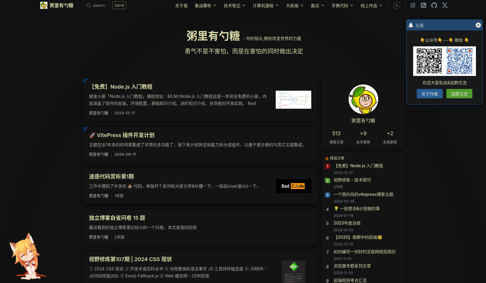
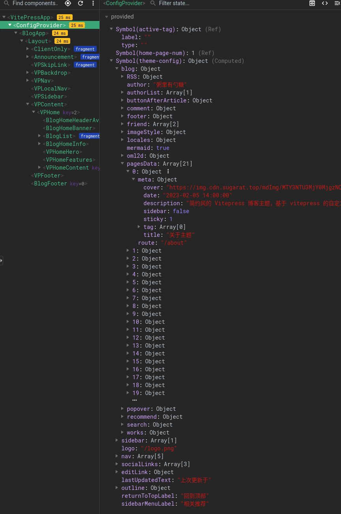

# 博客开发日志

在本系列文章中，我们将记录开发个人博客的全过程，特别是如何在 VitePress 基础上实现博客功能。VitePress 是一个轻量级文档生成工具，虽然具备出色的灵活性，但在博客的常用功能上并未提供开箱即用的支持。因此，我们将探索如何运用第三方主题和插件，定制出一个包含主页、归档、标签、评论等模块的完整博客。本文将逐步解构这一过程，分享如何通过配置和插件扩展 VitePress 的功能，使其适配个人博客的需求。

<!-- intro -->

一个基本的博客一般包括以下结构：

- 主页（一般是按时间展示过往文档）
- 归档（按标签分类、按时间/阅读量排序）
- 评论区

下面我按这些结构组织我是如何实现这些结构的。

## 博客主页
vitepress 原生的主页只支持自定义 hero 和 feature ，这些结构往往是开源项目的主页所需的，个人博客的主页往往展示过往文章。好在 vitepress 给了用户足够多的自由度自定义每个页面，在这里我们先看看社区中是如何自定义vitepress主页的。

我主要看了这个[awesome vitepress list](https://github.com/logicspark/awesome-vitepress-v1)，里边这两个 theme 是我比较喜欢的：

- [vitepress-blog-pure](https://github.com/airene/vitepress-blog-pure) 这个 theme 十分小巧，很适合初学者入手
- [sugar-blog](https://github.com/ATQQ/sugar-blog) 该 theme 功能齐全、代码结构清晰、内容丰富，很适合作为学习材料和模仿对象

我们来看看这两个 theme 是如何实现主页的：

### vitepress-blog-pure
[vitepress-blog-pure](https://ti.bi/)的主页长这样：


导航栏基本没变，主页主体变成了过往文章，主页最后还有一个分页器。

首先看下该项目的目录结构：
```sh
.
├── .vitepress
│   ├── config.ts
│   └── theme
│       ├── components
│       │   ├── Archives.vue
│       │   ├── Category.vue
│       │   ├── Comment.vue
│       │   ├── Copyright.vue
│       │   ├── NewLayout.vue
│       │   ├── Page.vue
│       │   └── Tags.vue
│       ├── custom.css
│       ├── functions.ts
│       ├── index.ts
│       └── serverUtils.ts
├── index.md
├── package.json
├── pages
│   ├── about.md
│   ├── archives.md
│   ├── category.md
│   └── tags.md
├── posts
│   └── vitepress-first.md
├── public
│   ├── favicon.ico
│   └── test.jpg
├── README.md
├── tsconfig.json
└── yarn.lock
```
首先会发现整个项目中没有`index.md`，这个文件应该是默认的 vitepress 主页才对，其实`index.md`是在构建的过程中生成的，具体的逻辑在`.vitepress/config.ts`的第14行：
```js:line-numbers{14}
import { defineConfig } from 'vitepress'
import { getPosts } from './theme/serverUtils'

//每页的文章数量
const pageSize = 10

export default defineConfig({
    title: 'Vitepress blog',
    base: '/',
    cacheDir: './node_modules/vitepress_cache',
    description: 'vitepress,blog,blog-theme',
    ignoreDeadLinks: true,
    themeConfig: {
        posts: await getPosts(pageSize),
        website: 'https://github.com/airene/vitepress-blog-pure', //copyright link
        // 评论的仓库地址
        comment: {
            repo: 'airene/vitepress-blog-pure',
            themes: 'github-light',
            issueTerm: 'pathname'
        },
...
```
14 行调用了一个 async 函数 `getPosts`。这个函数返回的对象保存在`themeConfig.posts`中，根据 [vitepress文档](https://vitepress.dev/reference/runtime-api#usedata) 中关于 useData 的说明，这个 posts 可以通过 `useData().theme.value.posts` 访问到，`getPosts`函数中会创建关于项目中所有文章的元信息以便在运行时访问，这个信息对于展示过往文章列表尤其重要。`ghetPosts` 函数的实现如下：
```js:line-numbers{10}
import { globby } from 'globby'
import matter from 'gray-matter'
import fs from 'fs-extra'
import { resolve } from 'path'

async function getPosts(pageSize: number) {
    let paths = await globby(['posts/**.md'])

    //生成分页页面markdown
    await generatePaginationPages(paths.length, pageSize)

    let posts = await Promise.all(
        paths.map(async (item) => {
            const content = await fs.readFile(item, 'utf-8')
            const { data } = matter(content)
            data.date = _convertDate(data.date)
            return {
                frontMatter: data,
                regularPath: `/${item.replace('.md', '.html')}`
            }
        })
    )
    posts.sort(_compareDate as any)
    return posts
}
```
这里用到了两个第三方包：`globby`和`gray-matter`，前者用来遍历文件目录（寻找目录下的 markdown 文件），后者用来处理 markdown 文件的 frontmatter 。这段代码除第10行以外的作用就是遍历当前目录，查找到所有的markdown文件，并将这些文件的目录信息、时间信息、frontmatter信息记录在posts变量中返回给调用者。

而第 10 行代码的作用就是生成上文中提到的`index.md`文件。

```js:line-numbers{7-26}
async function generatePaginationPages(total: number, pageSize: number) {
    //  pagesNum
    let pagesNum = total % pageSize === 0 ? total / pageSize : Math.floor(total / pageSize) + 1
    const paths = resolve('./')
    if (total > 0) {
        for (let i = 1; i < pagesNum + 1; i++) {
            const page = `
---
page: true
title: ${i === 1 ? 'home' : 'page_' + i}
aside: false
---
<script setup>
import Page from "./.vitepress/theme/components/Page.vue";
import { useData } from "vitepress";
const { theme } = useData();
const posts = theme.value.posts.slice(${pageSize * (i - 1)},${pageSize * i})
</script>
<Page :posts="posts" :pageCurrent="${i}" :pagesNum="${pagesNum}" />
`.trim()
            const file = paths + `/page_${i}.md`
            await fs.writeFile(file, page)
        }
    }
    // rename page_1 to index for homepage
    await fs.move(paths + '/page_1.md', paths + '/index.md', { overwrite: true })
}
```
该函数的 7-20 行便是所要生成的文档的模板，这个模板最终会保存到 `md` 后缀的文件中，而 vitepress 中的 markdown 文件是支持使用 vue 的，所以这里的模板虽然是用来生成 markdown 的，但看起来更像是 vue 的模板。第 17 行使用 `useData` 获取了上文中提到的 posts 信息，并将这个信息传递给了 `Page` 这个 Component，我们将在后文中介绍该组件。第 26 行将第一个分页重命名为 `index.md` 作为主页，

这个主页的内容很简单，只包括一个 `Page` Component，这个组件定义了主页的主体，而主页的导航栏则由 vitepress 生成。

下面来看看 Page 组件的实现：
```vue
<template>
    <div v-for="(article, index) in posts" :key="index" class="post-list">
        <div class="post-header">
            <div class="post-title">
                <a :href="withBase(article.regularPath)"> {{ article.frontMatter.title }}</a>
            </div>
        </div>
        <p class="describe" v-html="article.frontMatter.description"></p>
        <div class='post-info'>
            {{ article.frontMatter.date }} <span v-for="item in article.frontMatter.tags"><a :href="withBase(`/pages/tags.html?tag=${item}`)"> {{ item }}</a></span>
        </div>
    </div>

    <div class="pagination">
        <a
            class="link"
            :class="{ active: pageCurrent === i }"
            v-for="i in pagesNum"
            :key="i"
            :href="withBase(i === 1 ? '/index.html' : `/page_${i}.html`)"
        >{{ i }}</a>
    </div>
</template>
```
这段代码可以分成两部分，第一部分渲染传递进来的文章列表，将文章信息（比如文章题目、tag、时间）渲染出来，第二部分是分页器，每页对应一个按钮，点击按钮可以跳转到之前生成的`poage_{i}.md`文档，也就是其他分页。

### sugar-blog
[sugar-blog](https://sugarat.top/)的主页是这样子的：



对我来说元素过于丰富，不过正因为它有很多元素，这个 blog 是用来学习如何扩展 vitepress 的好例子。

sugar-blog 是 [monorepo](https://www.wikiwand.com/en/articles/Monorepo) 结构，它由若干功能独立的模块组成，所有的模块都放在一个 git 仓库下。具体来说，它包含了以下内容：

* [blogpress](./packages/blogpress/)：博客内容本身
* [@sugarat/theme](./packages/theme/)：博客分离出的通用 `VitePress` 主题
* [@sugarat/theme-shared](./packages/shared/)：`VitePress` 主题相关的工具方法
* [@sugarat/create-theme](./packages/create-theme/)：用于快速创建和作者一样风格的博客
* VitePress 插件相关：
  * [vitepress-plugin-pagefind](./packages/vitepress-plugin-pagefind/)：基于 pagefind 实现的 `VitePress` 离线全文搜索支持插件
  * [vitepress-plugin-rss](./packages/vitepress-plugin-rss/)：基于 feed 实现的 `VitePress` RSS 支持插件
  * [vitepress-plugin-51la](./packages/vitepress-plugin-51la/)：为 `VitePress` 站点引入 [51.la](https://v6.51.la/) 的网站数据统计能力。
  * [vitepress-plugin-announcement](./packages/vitepress-plugin-announcement/)：为 `VitePress` 创建一个全局公告窗口。
  * [vitepress-plugin-slot-inject-template](./template/vitepress-plugin-slot-inject-template/)：`VitePress` 插件开发模板。

第一个目录 `blogpress` 是作者自己的博客目录，我们不用去看里边的内容。

这里先介绍使用 sugar-blog 的方法：
1. 调用 sugar-blog 提供的函数 `getThemeConfig` 传入该 theme 相关的参数，得到一个 theme 对象
```ts
import { getThemeConfig } from '@sugarat/theme/node'
const blogTheme = getThemeConfig({
    ...
});
```
2. 根据 vitepress 文档中关于[自定义theme](https://vitepress.dev/guide/custom-theme#consuming-a-custom-theme) 的说明，将该 theme 对象传入 vitepress 的 extends 属性：
```ts:line-numbers{6}
// .vitepress/config.ts
import baseConfig from 'awesome-vitepress-theme/config'

export default {
  // extend theme base config (if needed)
  extends: baseConfig
}
```

sugar-blog 是通过添加 vite plugin 的方式扩展 vitepress 的功能的，这些 plugin 正是在上文的 `getThemeConfig` 中设置的：
```ts:line-numbers{16}
// packages/theme/src/node.ts
export function getThemeConfig(cfg: Partial<Theme.BlogConfig> = {}) {
  // 配置校验
  checkConfig(cfg)

  // 默认不开启 markdown 图表，会明显影响构建速度
  cfg.mermaid = cfg.mermaid ?? false

  // 文章数据
  const pagesData: Theme.PageData[] = []
  const extraVPConfig: any = {
    vite: {}
  }

  // 获取要加载的vite插件
  const vitePlugins = getVitePlugins(cfg)
  // 注册Vite插件
  registerVitePlugins(extraVPConfig, vitePlugins)
...
```
由于本节主要关心主页的实现，所以我们重点看是哪个插件提供了过往文章信息。上面第 16 行的 getVitePlugins 函数中添加了许多 plugin，其中的 `providePageData` plugin 就是提供过往文章信息的插件：
```ts
export function providePageData(cfg: Partial<Theme.BlogConfig>) {
  return {
    name: '@sugarat/theme-plugin-provide-page-data',
    async config(config: any, env) {
      const vitepressConfig: SiteConfig = config.vitepress
      const pagesData = await getArticles(cfg, vitepressConfig)
        ...
      vitepressConfig.site.themeConfig.blog.pagesData = pagesData
    },
  } as PluginOption
}
```
这个函数返回了一个对象，该对象包含一个`name`和一个名为`config`的函数，可以从 vite 的 [plugin](https://vite.dev/guide/api-plugin.html#config) 手册中找到它们的定义，name 是插件的名称，config 是用来更改 vite 构建时期 config 参数的回调函数。

我们可以在 config 回调函数中添加一个 conlose.log 看看这里的参数到底是什么：
```js
provide data config:  {
  root: '/home/annya/src/sugar-blog/packages/theme/docs',
  base: '/',
  cacheDir: '/home/annya/src/sugar-blog/packages/theme/docs/.vitepress/cache',
  plugins: [
    {
        name: 'vitepress',
        ...
    },
    {
        name: '@sugarat/theme-plugin-provide-page-data',
        config: [AsyncFunction: config]
    }
    ...
  ]
  ...
```
这是个很大的对象，里边包含了 vite 中的很多信息，就比如项目中引入的所有 plugins ，其中就包含了上面自定义的 `providePageData`。

值得注意的是，vitepress 也是作为一个 vite plugin 添加进项目中的，所以我们实际上可以通过这里的 config 回调参数找到 vitepress 内部的一些参数，这个参数的定义可以从 vitepress [源码](https://github.com/vuejs/vitepress/blob/c61775a54f1742a181dd685d92dc29bd60de6440/src/node/siteConfig.ts#L211) 中看到，它叫 `SiteConfig`，它里面就包含了我们感兴趣的内容：`pages`，这个属性是 vitepress 在解析项目中所有 markdown 文件是写入的，在上面的 console.log 中也可以看到：
```js
...
    pages: [
      'about.md',
      'changelog.md',
      'config/Independent.md',
      'config/component.md',
      'config/frontmatter.md',
      'config/global.md',
      'config/inline-matter.md',
      'config/style.md',
      'en/config/Independent.md',
      'en/config/component.md',
      'en/config/frontmatter.md',
      'en/config/global.md',
      'en/config/inline-matter.md',
      'en/config/style.md',
      'en/example/index.md',
      'en/index.md',
      'example/index.md',
      'group.md',
      'index.md',
      'plugins/index.md',
      'plugins/vitepress-plugin-announcement.md',
      'recommend.md',
      'sop/gh-pages.md',
      'sop/quickStart.md',
      'test/abc/hello/test.md',
      'timeline.md',
      'todo.md',
      'work.md',
      'test/abc/dynamic/1.0.0.md',
      'test/abc/dynamic/2.0.0.md'
    ],
...
```
有了个信息，我们理论上就可以展示过往文章信息了，虽然这些只是文件名，但我们可以通过这些文件名构造出它们的路径名，然后在文件系统中打开它们。事实上 sugar-blog 就是这么做的。相关的逻辑在[这里](https://github.com/ATQQ/sugar-blog/blob/2afc7cd55b47b887a8c5ec0a0e36757239acfd09/packages/shared/src/vitepress.ts#L6)。

现在我们知道文章信息是怎么来的了，那么这些信息是如何传给 vitepress 的呢？我们需要再回到`providePageData`函数中:
```ts:line-numbers{8}
export function providePageData(cfg: Partial<Theme.BlogConfig>) {
  return {
    name: '@sugarat/theme-plugin-provide-page-data',
    async config(config: any, env) {
      const vitepressConfig: SiteConfig = config.vitepress
      const pagesData = await getArticles(cfg, vitepressConfig)
        ...
      vitepressConfig.site.themeConfig.blog.pagesData = pagesData
    },
  } as PluginOption
}
```
第八行将文章信息传给了一串看起来很复杂的属性，分开来看其实并不复杂，它的前半部分`vitepressConfig.site.themeConfig`我们之前遇到过，它就是 vitepress 自己的 themeConfig 可以通过 `useData` 获取。而 blog.pagesData 则是 sugar-blog 的内部参数。我们可以在 vue-devtool 中查看到这些状态：


现在我们知道主页的数据是从哪来的了。那么 sugar-blog 的主页本身是如何定义的呢？其实和上面介绍的`vitepress-blog-pure`没有区别，都是按vitepress中的标准做法定义了自己的 Theme：
```js
export const BlogTheme: Theme = {
  ...DefaultTheme,
  Layout: withConfigProvider(BlogApp),
  enhanceApp(ctx) {
    enhanceAppWithTabs(ctx.app as any)
    DefaultTheme.enhanceApp(ctx)
    ctx.app.component('UserWorksPage', UserWorksPage as any)
  }
}

export * from './composables/config/index'

export default BlogTheme
```
这里的 `BlogApp` 中包含了 vitepress 的 `Layout`，并使用 vue 的 provide 方法暴露了 theme-config 以及其他的一些状态。

## 我的选择
vitepress-blog-pure 的做法简单直接，不过它额外引入了两个依赖`globby`和`gray-matter`，它引入数据的方式是直接在vitepress的config.ts中加入一个异步函数。

而sugar-blog的做法看起来更复杂，它使用了vitepress内部的参数用来寻找项目中所有的markdown文件，因此没有引入额外的依赖。而且它引入数据的方式是通过vite插件。

由于我打算长期更新本博客，我认为sugar-blog的做法更适合我，因为它可以很方便的集成功能（以插件的方式），插入新功能的自由度更大，所以本博客会以类似sugar-blog那样用插件的方式添加扩展功能。
