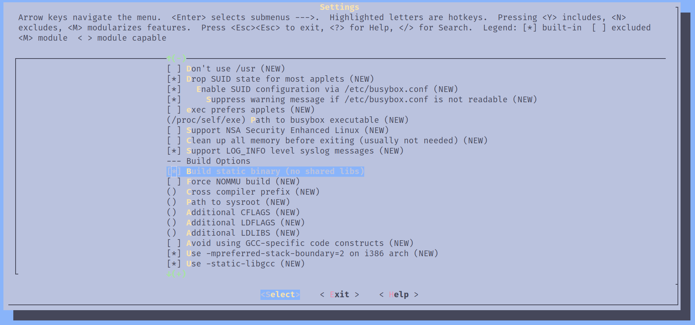

# 从零构建 Linux 系统镜像 -- 1. 最简单的 Linux 系统
Linux 作为广泛使用的操作系统，却不能像 Windows 或 MacOS 那样直接使用，Linux 必须以某种发行版的方式被使用，比如像`Debian`，`Arch` 还有最近很火的 `Nix`，这些“发行版”到底是什么呢？它里边具体包含了哪些内容呢？我希望这篇文章能帮助你了解这些发行版 linux 的本质，并打造属于自己独有的 Linux 系统。

<!-- intro -->

## 为什么需要发行版
在我们问为什么需要发行版的时候，我们其实可以反过来问，Linux 内核不提供什么？

Linux 本身只是内核，即运行在 CPU 高权限的空间，但当我们在使用操作系统的时候，很多现在看来必要的软件其实是运行在用户空间（即处于 CPU 低权限的状态），比如 Wayland、X11 这样的用户界面程序，还比如像 ls、mkdir 这样浏览文件系统的程序，还比如像 vi 这样的文本编辑器，gcc 这样的编译器，还有最重要的 shell 本身，这是我们执行命令的环境，所有这些重要的软件都是运行在用户空间。所以，**Linux 不提供用户常用的软件。**

现在由很多程序都是动态链接的，如果我们想要运行这些动态链接的程序，我们的系统中必须有这些动态链接库，而这些库 Linux 是并不提供的。举例来说，c 语言标准库是每个 c 程序必要的依赖，所以我们需要 glibc、musl、uclibc 这样的标准库。所以，**Linux 不提供动态链接库。**

你可能知道 Linux 运行的第一个用户进程是 [init](https://www.wikiwand.com/en/articles/Init)，这是一个用户进程，Linux 是不提供这个程序的。所以，**Linux 不提供 init 程序。**

计算机在上电启动后会进入到 BIOS/UEFI 配置好硬件环境，然后会把控制权交给 bootloader，这个 bootloader 会从硬盘中读取操作系统并进入操作系统，而 Linux 是不提供 bootloader 的。说到硬盘，用户空间的文件都是存储在文件系统上的，虽然 Linux 能够理解文件系统，但 Linux 本身不提供文件系统。所以**Linux 不提供 bootloader 和 文件系统。**

其实还有好多东西 Linux 不提供，比如字体、浏览器、网络/wifi 管理软件、包管理工具等等，Linux 只是内核，内核只是把硬件的功能抽象出来以系统调用的方式提供给用户空间使用，用户空间的所有东西都不是 Linux 本身提供的，所以，**我们需要发行版**来获得一个可以日常工作生活的 Linux 系统。

## 最简单的 Linux 系统
假设我现在把 Linux 的源码下载下来，然后执行`make menuconfig && make`，我可以在 `arch/xxx/` 目录下找到编译出来的内核本身，我还需要哪些东西才能运行包含这个内核的 Linux 系统呢？

本节将以这个问题为核心，试着构建一个最小的“可以工作的”Linux 系统还需要哪些东西。

### Qemu
我们的目标是在 [Qemu](https://www.qemu.org/)  上运行我们的 Linux 系统，之所以不选择以实机作为目标，是因为模拟器有更好的可操作性，你不需要有 u 盘、额外一台用来实验的电脑；更何况每个人手中的硬件千差万别，不同的硬件可能需要不同的 tweak，而模拟器的可复制性很强。

使用 qemu 的另一个好处是，qemu 内置了一个 bootloader，这样我们的 Linux 系统依赖的东西会更少。

### 根文件系统
我们现在已经有了一个 Linux 内核了，其实我们只差一个文件系统了，这个文件系统里包含着我们的小 Linux 系统所需的所有配置和软件。甚至，我们不需要一个文件系统，因为 Linux 支持 [initramfs](https://www.wikiwand.com/en/articles/Initramfs)，我们只需要准备一个能被读取到内存的目录结构就行，具体来说一个 [cpio](https://www.wikiwand.com/en/articles/Cpio) 归档文件就行。

我们可以依葫芦画瓢的方式仿照自己的根文件目录，创建一个简化版的目录：
```sh
> mkdir rootfs && cd rootfs
> mkdir -p {proc, sys, dev, run, tmp, bin}
> find . | cpio -o --format=newc > rootfs.cpio
```

这样我们就得到了一个最简单的 initramfs，可是这个根文件系统里什么都没有，我们还需要往里边加点东西才行。

### busybox
busybox 为我们提供了开箱即用的常用 linux 软件，比如 vi、ls 这样的软件都包含在其中，而且这些软件都是静态编译的，也就是说它们并不依赖动态库，可以开箱即用。

首先下载 busybox 源码并进入 menuconfig：
```sh
> git clone https://git.busybox.net/busybox
> cd busybox
> make menuconfig
```
选择静态编译：

在 menuconfig 中还能找到很多其他工具选项，可以根据需要选择。

选择完后执行 `make install`，这条指令会在 busybox 目录下创建一个 `_install`目录，进入这个目录会发现有以下内容：
```sh
> ls
bin  linuxrc sbin
```
bin 目录下是 busybox 准备的所有软件，然后我们在这个目录的基础上创建其他必要的根文件目录
```sh
> mkdir dev etc lib var proc tmp home root mnt sys
```

### init
在 linux 系统启动成功后，会运行 initramfs 根目录下的 init 文件，所以我们在在该目录下创建 init 脚本，这个脚本将为我们运行`/bin/sh`
```sh
> cat << 'EOF' > init
#!/bin/sh
mount -t proc proc /proc
mount -t sysfs sys /sys
echo "Welcome to Busybox Linux"
exec /bin/sh
EOF
> chmod +x init
```

### 运行我们的最小 Linux 系统
现在万事俱备，我们以这个目录构建 cpio 归档文件
```sh
> find . | cpio -o --format=newc > rootfs.cpio
```
接下来我们看看这个最小的系统有多大：
```sh
> ls -a rootfs.cpio
-rw-rw-r-- 1 annya annya 2.6M Nov  1 17:30 rootfs.cpio
> ll /path/to/bzImage
-rw-rw-r-- 1 annya annya 13M Jan  9  2024 /path/to/bzImage
```
根文件系统是 2.6M，而内核是 13M，一共不超过 20M，可以说是十分小巧的 Linux 系统了。接着尝试使用 Qemu 运行它：
```sh
qemu-system-x86_64 -kernel /path/to/bzImage -initrd /path/to/rootfs.cpio -append "console=ttyS0" -nographic
```
`-kernel`指定内核，`-initrd`指定 initramfs，`-append "console=ttyS0`将控制台输出重定向到串行接口，方便我们在 host 的终端看到 qemu 的输出，`-nographic`将不显示 qemu 的用户界面。

上述指令应该能顺利启动我们的最小 Linux 系统，并可以在这个系统中执行最简单的命令了。

