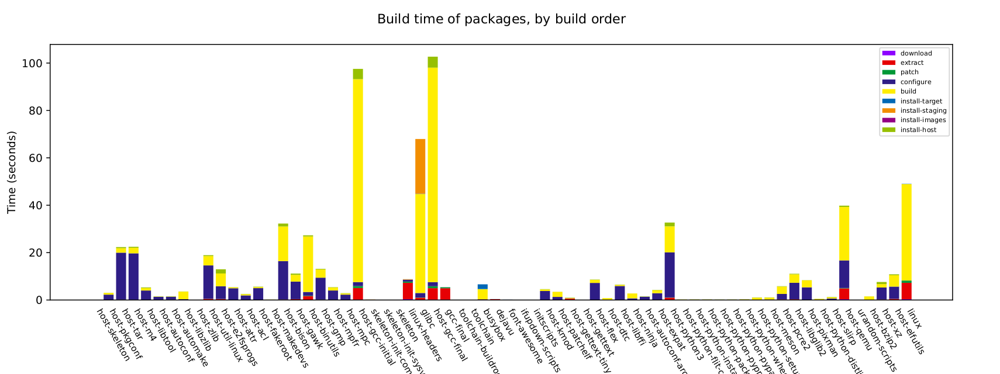

# 从零构建 Linux 系统镜像 -- 2. 使用 BuildRoot 构建 Linux 系统
Buildroot 是一个开源的构建工具，它提供了一个简单、高效的方式来构建 Linux 系统的完整工具链、内核和文件系统。

<!-- intro -->

## BuildRoot 上手
[上一篇文章](./从零构建linux系统镜像1) 构建了最简单的 Linux 系统，那个系统简单到只提供最基本的命令行工具，其他的一概没有，而且构建起来还挺麻烦的。有办法只用一条指令就构建出可用的 Linux 系统吗？BuildRoot 工具就为我们提供了这样的便捷。下面通过逐步操作来看看使用 BuildRoot 构建 Linux 系统有多么简单。

1. 下载 BuildRoot 源码
```sh
> git clone https://github.com/buildroot/buildroot
```

2. 选择编译架构和要安装的包
使用`make menuconfig`进入 UI 界面设置编译架构还有想要安装的包，基本上常用的包都可以找到。也可以使用 BuildRoot 为我们提供的默认设置，可以通过`make list-defconfigs`查看所有的预设配置。这里依然按照上一篇文章的思路选择编译成 qemu 可以运行的系统镜像，BuildRoot 恰好为我们提供了这样的配置：
```sh
> make qemu_x86_64_defconfig
```

3. 运行编译系统
```sh
> make
```

4. 使用 qemu 运行系统
make 指令运行完后可以在`output/images/`目录下找到编译的系统镜像。在这个目录下，buildroot 还贴心的准备了一个运行 qemu 的 shell 脚本，直接运行这个脚本就能启动编译出来的操作系统。
```sh
> ./start-qemu.sh
```

就这么简单！

另外，buildroot 还提供了很多调试指令，比如查看所有的 kconfig 变量，查看所有的被编译的包，查看编译时间图。
使用如下指令就能看到编译时间图：
```sh
> make graph-build
```
在目录`output/graphs`下就能看到生成的图：


使用`make show-info`可以看到所有的包信息，可以在[这里](https://jsonhero.io/j/SJ19LivYBdSK)预览。

但只是简单的使用这个工具并不是这篇文章的目的，我们还需要追问，buildroot 究竟帮我们做了哪些事情？buildroot 是如何做到有如此高的可配置性的？要回答这些问题，我们需要渗入到 BuildRoot 的源码。

## BuildRoot 源码分析
BuildRoot 和上一篇文章中的最小 Linux 系统的构建过程类似，本质上它就是创建了一个根文件系统，设置了一些最基本的 Linux 配置，并往这个文件系统中安装了必要的软件。

但问题是：
- 哪些软件是必要的？这是谁定义的？有相关的规定么？
- 究竟需要哪些必要的配置
- 怎么保证编译出来的软件不依赖本机的工具链

为了回答这些问题，我们从零开始写一个类似于 BuildRoot 的构建系统（当然功能要简单的多，但麻雀虽小，五脏俱全），在构建的过程中试着回答上述问题。互联网上有一个很好的学习资料可供参考，那就是[LinuxFromScratch(LFS)](https://www.linuxfromscratch.org/)，这个站点提供了一本教你如何一步一步构建自己的 Linux 系统的小册子。在下一篇文章中，我们将以 LFS 为线索，试着构建一个类似于 BuildRoot 的构建系统。
