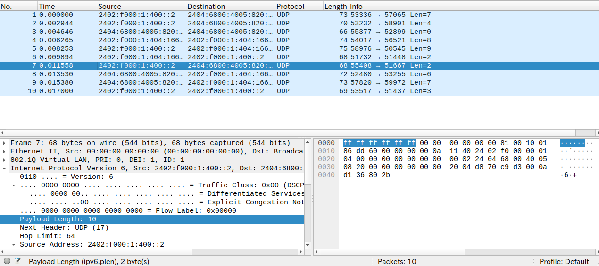

# 清华大学计算机网络实验 -- internet-checksum
关于[清华大学计算机网络实验](https://lab.cs.tsinghua.edu.cn/router/doc/software/first_stage/)的随笔。这次的实验内容是关于 ipv6 下的 UDP 和 ICMP 的校验和实现。

<!-- intro -->
##  实验详情随笔
UDP 和 ICMP 在 ipv6 协议中校验和计算流程是遵循相似流程的。具体来说，他们有相似的校验和计算流程，具体的流程可以参考实验的 [README](https://github.com/thu-cs-lab/Router-Lab/blob/master/Homework/internet-checksum/README.md)。

### 补充知识
- 这次实验需要熟悉 linux 中关于`ipv6`,`icmp`,`udp`网络协议相关的结构体。

    ipv6 的头部结构体如下：
    ```c
    struct ip6_hdr
    {
    union
        {
    struct ip6_hdrctl
        {
        uint32_t ip6_un1_flow;   /* 4 bits version, 8 bits TC,
                    20 bits flow-ID */
        uint16_t ip6_un1_plen;   /* payload length */
        uint8_t  ip6_un1_nxt;    /* next header */
        uint8_t  ip6_un1_hlim;   /* hop limit */
        } ip6_un1;
    uint8_t ip6_un2_vfc;       /* 4 bits version, top 4 bits tclass */
        } ip6_ctlun;
    struct in6_addr ip6_src;      /* source address */
    struct in6_addr ip6_dst;      /* destination address */
    };
    ```
    linux 定义了一些宏来方便的访问这些结构体字段，比如可以使用`ip6->ip6_plen`访问`ip6->ip6_ctlun.ip6_un1.ip6_un1_nxt`.


- `ntohs`的使用  
    由于网络中使用的大端端序，需要使用 linux 提供的 `ntohs`(network to host short) 接口将大端端序转成本机使用的端序，由于计算校验和是以 16 比特为一组进行计算，所以这个实验只用到了`ntohs`。


- pseudo header  
    UDP 和 ICMP 在计算校验和的时候使用的是“pseudo header”，之所以用这个而不是真实的 ipv6/ipv4 header 是因为真实的 ip header 有一些动态字段（比如 Hop Limit），还可能会有扩展的头部字段。而 UDP 和 ICMP 的协议只关注端到端的信息，这些 ip header 提供的额外信息并不影响 UDP 和 ICMP 传输层协议，也就没有必要计算他们的校验和。
    pseduo header 的具体格式可以参考[wiki](https://www.wikiwand.com/en/articles/User_Datagram_Protocol#IPv6_pseudo_header)

### 实现细节
- 测试 :test_tube:  
    和之前的实验一样，只需要使用`make grade`指令就能进行测试，这个指令主要分为两大步：
    1. 以`data/checksum_input*.pcap`作为标准输入调用编译出的程序，将输出保存到`data/checksunm_output*.txt`，比如`./checksum < data/checksum_input1.pcap > data/checksum_output1.txt`
    2. 调用目录下的`grade.py`脚本使用 diff 工具比较`data`目录下的 output 生成文件和预先提供的 answer 文件。
    我们可以用 Wireshark 打开`data`目录下的 pcap 文件，以 GUI 的方式查看数据将极大的帮助我们调试程序：
        
    在`grade.py`中可以暂时把 total 改为 1，让我们每次只关注一个测试样例。

- 抽象出共有代码  
    UDP 和 ICMP 都需要将`伪头部`，`自己的头部`，`数据`以16位为一组做和，UDP和ICMP的头部有所不同，而伪头部和数据可以抽象出相同的逻辑。
    数据packet是以`uint8_t`存储的，我们可以将它强转为`uint16_t`的数组：`uint16_t *data = (uint16_t *)&packet[sizeof(struct ip6_hdr) + sizeof(struct udphdr)];`


- 数据个数为奇数的情况
    这种情况下将它截取为8位，然后用`ntohs`再转换为16位。


### 实现代码
```c
void ip6_header_sum(uint8_t *packet, uint32_t &sum) {
    struct ip6_hdr *ip6 = (struct ip6_hdr *)packet;
    for (int i = 0; i < 8; i++) {
        uint32_t n = ntohs(ip6->ip6_src.s6_addr16[i]);
        sum += n;
    }
    for (int i = 0; i < 8; i++) {
        uint32_t n = ntohs(ip6->ip6_dst.s6_addr16[i]);
        sum += n;
    }
    uint32_t length = ntohs(ip6->ip6_plen);
    sum += length;
    uint32_t nxt = ip6->ip6_nxt;
    sum += nxt;
}

void message_sum(uint16_t *data, size_t len, uint32_t &sum) {
    if (len == 0) {
        return;
    }
    int ind = 0;
    for (; ind * 2 < len - 1; ind += 1) {
        sum += ntohs(data[ind]);
    }
    if (len % 2 == 1) {
        uint16_t tmp = data[ind] & 0xff;
        sum += ntohs(tmp);
    }
}

bool validate_checksum(uint32_t sum, uint16_t &checksum) {
    uint32_t sum_without_check = sum;
    sum += ntohs(checksum);
    while (sum_without_check > 0xffff) {
        sum_without_check = (sum_without_check & 0xffff) + ((sum_without_check & 0xffff0000) >> 16);
    }
    uint16_t check_sum = (uint16_t)sum_without_check;
    check_sum = ~check_sum;
    while (sum > 0xffff) {
        sum = (sum & 0xffff) + ((sum & 0xffff0000) >> 16);
    }
    checksum = htons(check_sum);
    if (sum != 0xffff) {
        return false;
    } else {
        return true;
    }
}

bool validateAndFillChecksum(uint8_t *packet, size_t len) {
    struct ip6_hdr *ip6 = (struct ip6_hdr *)packet;

    // check next header
    uint8_t nxt_header = ip6->ip6_nxt;
    if (nxt_header == IPPROTO_UDP) {
        // UDP
        struct udphdr *udp = (struct udphdr *)&packet[sizeof(struct ip6_hdr)];
        uint32_t sum = 0;
        ip6_header_sum(packet, sum);

        sum += ntohs(udp->source);
        sum += ntohs(udp->dest);
        sum += ntohs(udp->len);
        int data_len = ntohs(udp->len) - 8;
        uint16_t *data = (uint16_t *)&packet[sizeof(struct ip6_hdr) + sizeof(struct udphdr)];

        message_sum(data, data_len, sum);

        return validate_checksum(sum, udp->check);
    } else if (nxt_header == IPPROTO_ICMPV6) {
        // ICMPv6
        struct icmp6_hdr *icmp = (struct icmp6_hdr *)&packet[sizeof(struct ip6_hdr)];
        uint32_t sum = 0;
        uint32_t payload_len = ntohs(ip6->ip6_plen);
        ip6_header_sum(packet, sum);
        sum += (icmp->icmp6_type << 8) + (icmp->icmp6_code);
        uint32_t message_len = payload_len - 4;
        uint16_t *data = (uint16_t *)&packet[sizeof(struct ip6_hdr) + 4];
        message_sum(data, message_len, sum);

        return validate_checksum(sum, icmp->icmp6_cksum);
    } else {
        assert(false);
    }
    return true;
}

```


